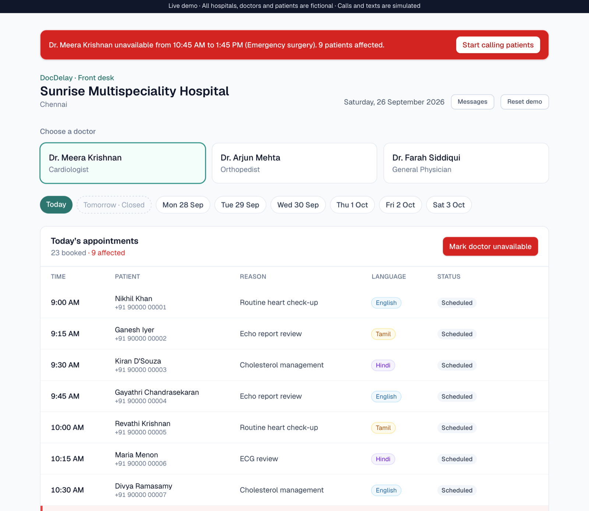
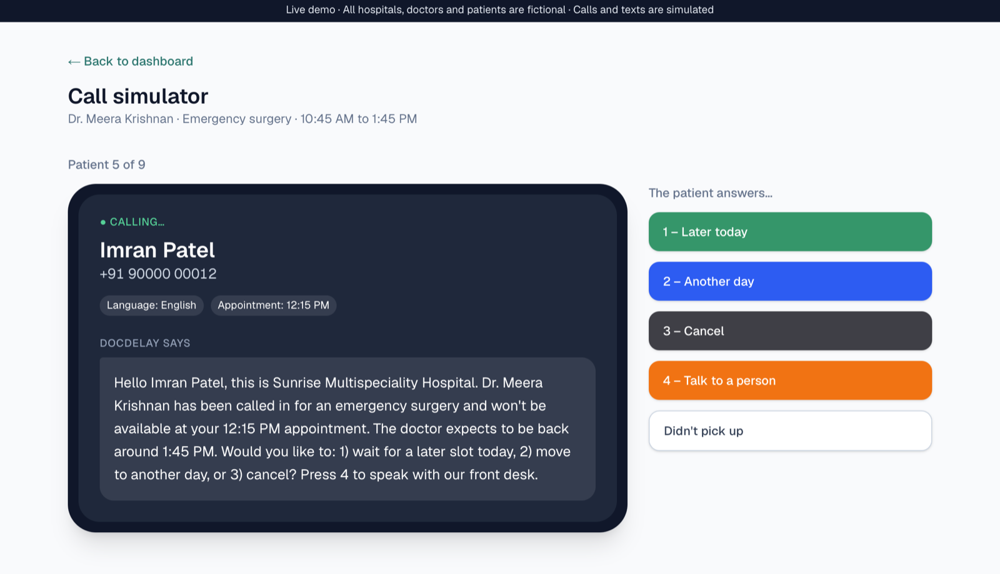
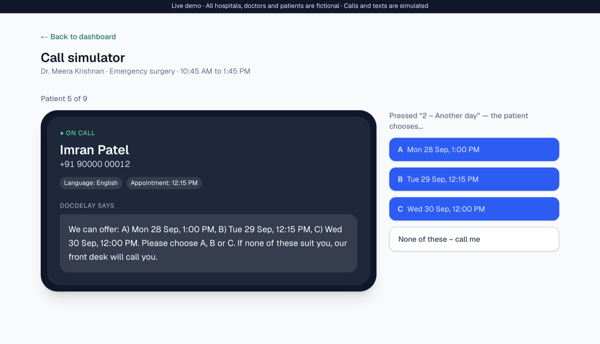
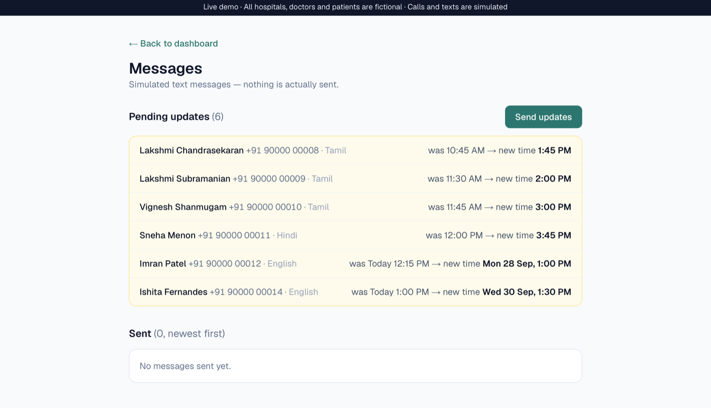

# DocDelay

**When a doctor is suddenly pulled into emergency surgery, DocDelay finds every affected patient, calls them in their own language, and rebooks them — later today or on another day — so nobody is left waiting in the lobby.**

> **MVP — all hospital, doctor and patient data is fictional; calls and texts are simulated.**
> No real phone calls are made and no real text messages are sent. Phone numbers are placeholders (`+91 90000 00001`, …).

<!--
  SCREENSHOTS (hidden until added): save the images in docs/screenshots/ with
  these names, then delete this comment's opening and closing lines.





-->

---

## The problem

A cardiologist has a full afternoon clinic. At 10 AM they're called into emergency surgery and won't be back until 1 PM. Twelve patients are booked in that window — some already travelling to the hospital.

Today, the front desk has to work this out by hand: find the affected appointments, phone each patient, find new slots without double-booking, and let everyone else know if their time moves. It's slow, stressful, and patients often just wait for hours.

DocDelay plugs into the hospital's management system (HMS), finds the affected appointments automatically, and contacts each patient to ask: **wait for a later slot today, move to another day, or cancel?**

## Key features

- **Front-desk dashboard** — pick a doctor and a day (today + the next 7 days) and see every appointment with a colour-coded status.
- **"Mark doctor unavailable"** — choose a reason and a time window; every appointment inside it is flagged and a red banner shows how many patients are affected.
- **Simulated patient calls in English, Tamil and Hindi** — a phone-style call simulator reads each patient a message in their preferred language. The operator plays the patient: *1 – Later today, 2 – Another day, 3 – Cancel, 4 – Talk to a person,* or *Didn't pick up*.
- **Later-today rescheduling** — finds the patient a new slot after the doctor's return and tells them the new time on the call.
- **Another-day rescheduling** — offers three open slots over the next week (A / B / C) and books the one they pick.
- **One-text-per-patient outbox** — every patient whose time changed gets exactly one text with their *final* time, in their language, once staff press "Send updates".
- **Full audit trail** — each appointment keeps a call log and a history of time changes (old time, new time, why).

## Product decisions (and why)

| Decision | Why |
|---|---|
| **Use free slots first; only then push others back.** | Filling a gap moves nobody else. Pushing later patients back 15 minutes is a last resort. |
| **Patients are placed in the order they answer.** | First come, first served. Someone who said "later today" first shouldn't be bumped by someone who answered after them. |
| **45-minute fairness cap** (`MAX_PUSH_MINUTES`) | Patients who *weren't* affected shouldn't pay for the delay. No unaffected patient is ever pushed more than 45 minutes past their original time (all pushes counted together). |
| **7 PM hard limit** (`LATEST_APPOINTMENT_END`) | The day may run late, but not indefinitely. If fitting someone in would run past 7 PM, it's "no room today". |
| **"No room today" → offer other days straight away** | The patient is already on the phone. Offering three concrete choices beats "someone will call you back". |
| **Morning ↔ morning, afternoon ↔ afternoon** | A patient booked at 10 AM probably arranged their day around a morning visit. Offers match the part of the day first, then the earliest days, then the closest time. |
| **Staff-approved texts** | Changes are queued as *pending updates* (one per patient, always holding the latest time). Staff review and press "Send updates". This avoids a flood of messages when someone is moved several times, and keeps a human in the loop. |
| **The hospital system sits behind one module** | All data access lives in `src/hms/mockHms.ts`. A real HMS (FHIR or a custom API) can replace the mock without touching the screens. |
| **Rules live in one file** | Every rescheduling rule and setting (slot length, 5 PM / 7 PM, 45 minutes, closed days…) is in `src/lib/reschedulingRules.ts`, so a hospital can tune them in one place. |

The Tamil and Hindi wording was written for this demo and is marked in the code as needing review by native speakers before any real use.

## Tech stack

- [Next.js 16](https://nextjs.org) (App Router, Server Components, Server Actions)
- React 19 + TypeScript
- Tailwind CSS 4
- Local JSON storage — no database or cloud services. Starting data lives in `src/hms/mockData.json`; the current demo state is saved to `data/hms-state.json` (git-ignored).

## Run it locally

You'll need [Node.js](https://nodejs.org) 20.9 or newer.

```bash
git clone https://github.com/tarunrambabu-lab/docdelay.git
cd docdelay
npm install
npm run dev
```

Then open **http://localhost:3000**.

### A 2-minute demo

1. Choose **Dr. Meera Krishnan** and click **Mark doctor unavailable**. Set **9:00 AM → 11:00 AM** and submit.
2. Click **Start calling patients** in the red banner.
3. Press **1 – Later today** for the first patient — they get the first free slot after 11 AM.
4. Press **2 – Another day** for the next patient and pick **A**, **B** or **C**.
5. Open **Messages** to see the pending texts, then click **Send updates**.
6. Click **Reset demo** (top right) to start over.

The demo data is always relative to *today*, so it works on any day.

## Project structure

```
src/
  hms/
    mockHms.ts           ← the only code that reads/writes hospital data (swap for a real HMS)
    mockData.json        ← fictional hospital, doctors, patients, 8 days of appointments
    types.ts             ← shared data shapes
  lib/
    reschedulingRules.ts ← all rescheduling rules and hospital settings
    callScript.ts        ← what the call says, in English / Tamil / Hindi
    smsText.ts           ← text-message wording
  app/
    page.tsx             ← front-desk dashboard
    calls/[id]/          ← call simulator
    messages/            ← SMS outbox (pending + sent)
```

## Roadmap

- **AI conversation** — replace the keypad menu with a natural spoken conversation, so patients can just say what they want ("anything after 3 is fine").
- **Real calls and texts** — connect a telephony/SMS provider so patients are actually called and messaged.
- **Real HMS integration** — replace the mock with a FHIR or hospital-specific API adapter behind the same `hms` interface.

Smaller items are tracked in [BACKLOG.md](BACKLOG.md).

## Built with Claude Code

Built with [Claude Code](https://claude.com/claude-code) as an AI pair-programmer: I described each stage and its product rules; Claude Code wrote and tested the code, and I reviewed and steered the decisions. The project's working rules for the AI are in [CLAUDE.md](CLAUDE.md).
