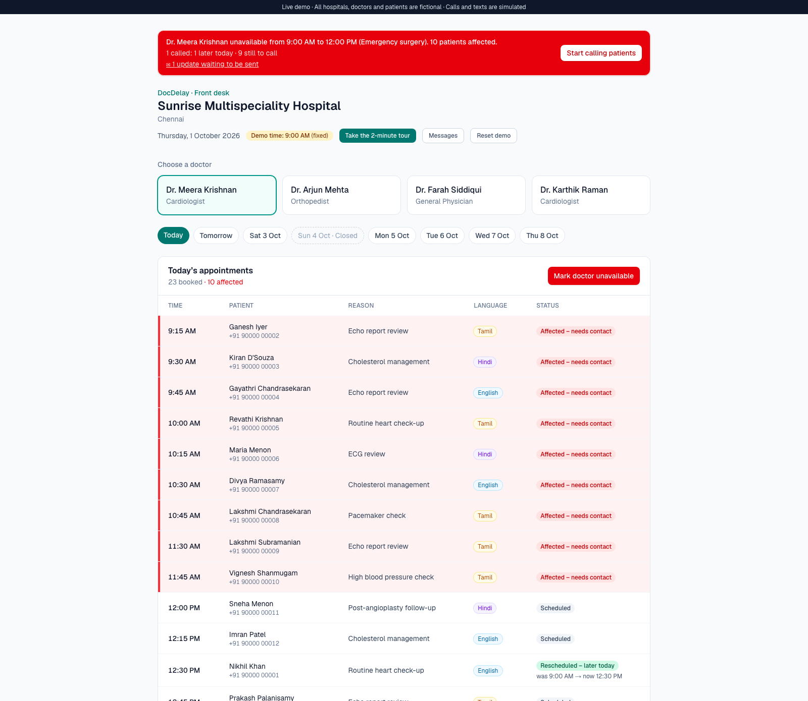
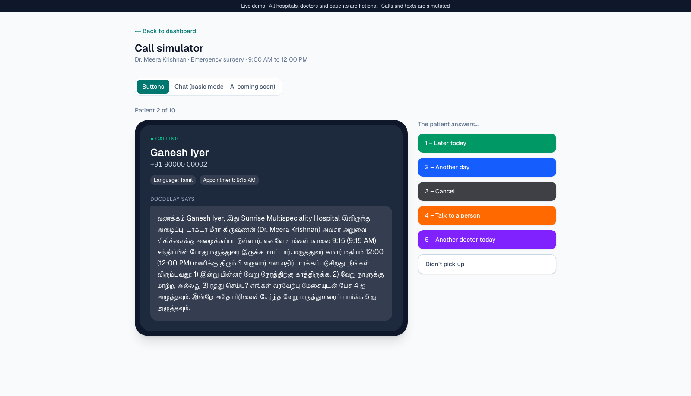
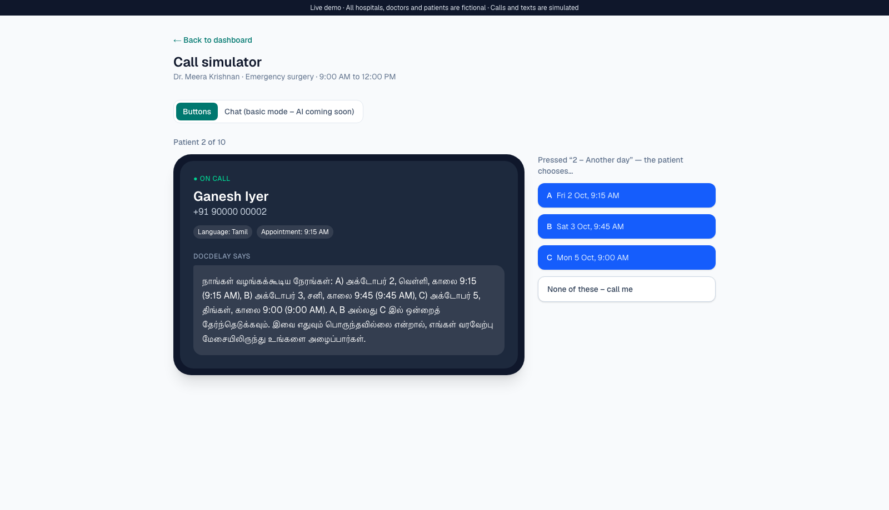
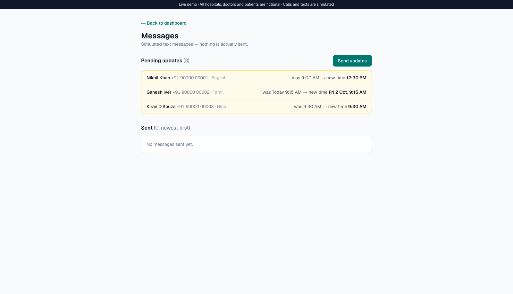

# DocDelay

**▶ Live demo: [docdelay-three.vercel.app](https://docdelay-three.vercel.app)** — every visitor gets their own private demo; press "Reset demo" to start over.

**When a doctor is suddenly pulled into emergency surgery, DocDelay finds every affected patient, calls them in their own language, and rebooks them — later today, with another doctor today, or on another day — so nobody is left waiting in the lobby.**

> **MVP — all hospital, doctor and patient data is fictional; calls and texts are simulated.**
> No real phone calls are made and no real text messages are sent. Phone numbers are placeholders (`+91 90000 00001`, …).






---

## The problem

A cardiologist has a full afternoon clinic. At 10 AM they're called into emergency surgery and won't be back until 1 PM. Twelve patients are booked in that window — some already travelling to the hospital.

Today, the front desk has to work this out by hand: find the affected appointments, phone each patient, find new slots without double-booking, and let everyone else know if their time moves. It's slow, stressful, and patients often just wait for hours.

DocDelay plugs into the hospital's management system (HMS), finds the affected appointments automatically, and contacts each patient to ask: **wait for a later slot today, move to another day, or cancel?** If another doctor from the same department is free today, the patient can also choose to see them.

## Key features

- **Front-desk dashboard** — pick a doctor and a day (today + the next 7 days) and see every appointment with a colour-coded status.
- **"Mark doctor unavailable"** — choose a reason and a time window; every appointment inside it is flagged and a red banner shows how many patients are affected.
- **Simulated patient calls in English, Tamil and Hindi** — a phone-style call simulator reads each patient a message in their preferred language. The operator plays the patient: *1 – Later today, 2 – Another day, 3 – Cancel, 4 – Talk to a person, 5 – Another doctor today* (only when one is free), or *Didn't pick up*.
- **Later-today rescheduling** — finds the patient a new slot after the doctor's return and tells them the new time on the call.
- **Another-day rescheduling** — offers three open slots over the next week (A / B / C) and books the one they pick.
- **Another doctor today** (button mode) — offers up to three empty slots today with another doctor from the same department, only doctors the hospital has approved to cover. The patient's original slot is freed, the booking moves to the other doctor's schedule, and nobody else is moved. The text names the new doctor.
- **One-text-per-patient outbox** — every patient whose time changed gets exactly one text with their *final* time, in their language, once staff press "Send updates".
- **Chat mode** — instead of pressing buttons, type what the patient says ("Can I come Thursday after 4?", "naan wait panren", "cancel kar do"). With an Anthropic API key set, **Claude Haiku 4.5** handles the conversation, using two tools (`checkFreeSlots`, `bookSlot`) that apply all the hospital's rules — the AI only talks, it never decides. Without a key (as on the live demo) a free rule-based stand-in does the same job. If the AI fails, that message falls back to the stand-in.
- **Health-concern safety net** — any mention of a symptom stops rescheduling at once, replies with a fixed "connecting you to staff / call 108" line, and puts the patient at the top of the dashboard as **URGENT – staff call now**. It never books or prioritises a slot, and never gives medical advice. Staff can mark false alarms.
- **Demo clock** — the demo's clock is fixed at 9:00 AM (on today's date in India), shown on the dashboard as "Demo time: 9:00 AM (fixed)", so the demo works the same at any time of day. All code gets the time from one file, `src/lib/clock.ts`, which can be switched to the real time later.
- **Full audit trail** — each appointment keeps a call log, the full chat, and a history of time changes (old time, new time, why). Click any row on the dashboard to see it.

## Product decisions (and why)

| Decision | Why |
|---|---|
| **Use free slots first; only then push others back.** | Filling a gap moves nobody else. Pushing later patients back 15 minutes is a last resort. |
| **Patients are placed in the order they answer.** | First come, first served. Someone who said "later today" first shouldn't be bumped by someone who answered after them. |
| **45-minute fairness cap** (`MAX_PUSH_MINUTES`) | Patients who *weren't* affected shouldn't pay for the delay. No unaffected patient is ever pushed more than 45 minutes past their original time (all pushes counted together). |
| **7 PM hard limit** (`LATEST_APPOINTMENT_END`) | The day may run late, but not indefinitely. If fitting someone in would run past 7 PM, it's "no room today". |
| **Other days: empty slots only** | Moving someone on another day to fit a delayed patient would just spread the disruption. Every slot DocDelay offers comes from the same empty-slot search (`checkFreeSlots` in chat), and it's re-checked just before booking — if two patients pick the same slot, the first wins and the second gets fresh options. |
| **Another doctor: approved, same specialty, empty slots only** | Only doctors the hospital has approved to cover for the unavailable doctor, of the same specialty, are offered — the list lives in the hospital data, not the screens. Slots are today, at or after the patient's original time, ending by 5 PM, and the other doctor's patients are never moved. If no such slot exists, the option isn't shown. |
| **Health concerns always go to a person** | Software must never judge how serious a symptom is. The check is deliberately broad (false alarms are cheap; staff clear them with one click), and it runs before any AI, so obvious concerns never depend on a model. |
| **"No room today" → offer other days straight away** | The patient is already on the phone. Offering three concrete choices beats "someone will call you back". |
| **Morning ↔ morning, afternoon ↔ afternoon** | A patient booked at 10 AM probably arranged their day around a morning visit. Offers match the part of the day first, then the earliest days, then the closest time. |
| **Staff-approved texts** | Changes are queued as *pending updates* (one per patient, always holding the latest time). Staff review and press "Send updates". This avoids a flood of messages when someone is moved several times, and keeps a human in the loop. |
| **The hospital system sits behind one module** | All data access lives in `src/hms/mockHms.ts`. A real HMS (FHIR or a custom API) can replace the mock without touching the screens. |
| **A fixed demo clock** | A demo visited at 11 PM shouldn't behave differently from one at 10 AM. Fixing the clock at 9:00 AM — the first slot of the day — also means nothing can ever be offered in the past. |
| **Rules live in one file** | Every rescheduling rule and setting (slot length, 5 PM / 7 PM, 45 minutes, closed days…) is in `src/lib/reschedulingRules.ts`, so a hospital can tune them in one place. |

The Tamil and Hindi wording was written for this demo and is marked in the code as needing review by native speakers before any real use.

## Tech stack

- [Next.js 16](https://nextjs.org) (App Router, Server Components, Server Actions)
- React 19 + TypeScript
- Tailwind CSS 4
- No database or cloud services. Starting data lives in `src/hms/mockData.json`. Each visitor's demo is kept in a small cookie in their own browser — it stores the list of steps they took (not the data), and the server replays them on every request — so every visitor gets a private demo and "Reset demo" just clears the cookie.

## Run it locally

You'll need [Node.js](https://nodejs.org) 20.9 or newer.

```bash
git clone https://github.com/tarunrambabu-lab/docdelay.git
cd docdelay
npm install
npm run dev
```

Then open **http://localhost:3000**.

Optional — to use the Claude-powered chat, create a `.env.local` file with `ANTHROPIC_API_KEY=your-key` (it's git-ignored). Each AI message's token use and estimated cost is printed in the terminal.

### A 2-minute demo

1. Choose **Dr. Meera Krishnan** and click **Mark doctor unavailable**. Set **9:00 AM → 11:00 AM** and submit.
2. Click **Start calling patients** in the red banner.
3. Press **1 – Later today** for the first patient — they get the first free slot after 11 AM.
4. Press **2 – Another day** for the next patient and pick **A**, **B** or **C**.
5. Press **5 – Another doctor today** for the next patient and pick a time with **Dr. Karthik Raman**, the hospital's second cardiologist.
6. Open **Messages** to see the pending texts, then click **Send updates**.
7. Click **Reset demo** (top right) to start over.

The demo data is always relative to *today*, and the demo clock is fixed at 9:00 AM, so it works on any day and at any time.

## Project structure

```
src/
  hms/
    mockHms.ts           ← the only code that reads/writes hospital data (swap for a real HMS)
    visitorState.ts      ← keeps each visitor's demo steps in a cookie
    mockData.json        ← fictional hospital, 4 doctors (2 cardiologists), patients, 8 days of appointments
    types.ts             ← shared data shapes
  lib/
    reschedulingRules.ts ← all rescheduling rules and hospital settings
    clock.ts             ← the demo clock: the only place the app reads the time
    understanding/       ← turns a chat message into an intent (rules today; Claude later — one setting)
    chatReplies.ts       ← chat-only lines (incl. the fixed urgent line)
    callScript.ts        ← what the call says, in English / Tamil / Hindi
    smsText.ts           ← text-message wording
  app/
    page.tsx             ← front-desk dashboard
    calls/[id]/          ← call simulator
    messages/            ← SMS outbox (pending + sent)
```

## Roadmap

- **AI conversation in the live demo** — the Claude-powered chat works locally (`src/lib/understanding/`); before switching it on publicly, move the site-wide spending counter to a shared store and set a spend limit on the API key.
- **Real calls and texts** — connect a telephony/SMS provider so patients are actually called and messaged.
- **Real HMS integration** — replace the mock with a FHIR or hospital-specific API adapter behind the same `hms` interface.

Smaller items are tracked in [BACKLOG.md](BACKLOG.md).

## Built with Claude Code

Built with [Claude Code](https://claude.com/claude-code) as an AI pair-programmer: I described each stage and its product rules; Claude Code wrote and tested the code, and I reviewed and steered the decisions. The project's working rules for the AI are in [CLAUDE.md](CLAUDE.md).

---

© 2026 Tarun Ramesh Babu. All rights reserved. This code is shared for portfolio viewing only and may not be copied, reused or redistributed without permission.
